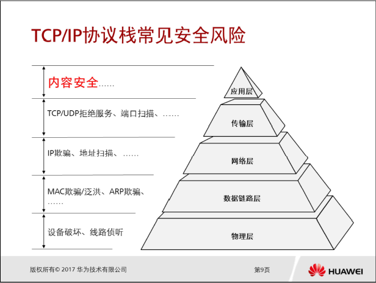

# HCIP-Security-CSSN 学习笔记

安全能力：PDRR  P: Protection D: Detection R: Response R: Recovery

NGFW全局环境感知ACTUAL: Application Content Time User Attack Location
智能感知引擎Intelligent Awareness Engine 高性能内容安全引擎
分片重组、流重组 >> 协议识别 >> 协议解码 >> 文件识别解码过滤 >> 业务处理

RBL由RBL服务提供商提供。
邮件内容封装在SMTP中，则执行发送方向检测。若封装在POP3或者IMAP中，则执行接收方向检测。

注入漏洞的本质是混淆数据和执行代码，是输入数据变成可执行的语句。
SQL注入攻击是最常见危害最严重的注入攻击。

跨站脚本XSS本质是恶意代码执行方式，由于网站对用户提交数据过滤不严格导致。危害由盗取用户Cookie信息入手。
基本跨站类型有反射型（代码一般存在于连接中）和存储型（最方便，跨站代码存储与服务端）。

跨站请求伪造CSRF盗用伪装来自受信任用户的请求来利用受信任的网站，问题如个人隐私泄露以及财产安全。
受害者需要登陆受信任网站A并在本地生成Cookie,接着访问危险网站B。
Cookie是由Web服务器发出，在HTTP响应消息头中附带传给浏览器的数据，可以不相同。一旦保存，浏览器将在每次访问该服务器时回传该数据。
Session是应用服务器维持的服务器端的存储空间。
用户请求Session时要求带上Cookie信息，服务器通过Session ID读取，返回信息。抓包工具可以盗用Session。为提高安全和可靠性，可以设置过期，增加签名内容，或者限制用户IP等等。

Web安全防御手段
架构上 行为规范 URL过滤 恶意网站检测
语言上 应用系统防御/入侵检测
通信通道上 Anti DDoS

URL格式： protocol://hostname[:port]/path[?query]
URL过滤原理：截取HTTP连接GET或POST请求，判断合法性。
URL匹配优先级：精确匹配>后缀匹配>前缀匹配>关键字匹配
同一匹配方式下，匹配规则越长优先级越高。同一匹配方式规则长度也相同则按照配置动作模式为准。
Web信誉体系分类：预定义可信、自定义可信、自定义可疑、未知网站
后两者系统提取网络流量文件送往沙箱进行检测。

WAF通过规则对HTTP报文中每一个字段进行过滤。
由执行前端、后端中心、数据库组成，基于7层防护技术又称纵深安全防御：黑名单特征检测（字段解析，内容报文匹配）和协议重组检测（包分片缓存，重组匹配特征库）。
CC攻击与DDOS攻击方式不同是一般针对WEB页面进行攻击。
自学习建模与白名单防护： WAF通过访问流量的自学习和概率统计算法自动生成策略规则。
高性能检测：对静态文件线速转发，对于动态文件进行规则检测及过滤再转发到Web应用服务器。
防篡改技术：基于缓存模块，对比服务器页面，视觉防篡改。
高速缓存技术：缓存静态文件减少服务器交互数据，提高服务器处理性能。

WAF部署模式：
透明代理：直连无需改变现有环境，且实现对服务器隐藏。
反向代理：WAF在旁路模式抢占服务器IP，访问先到WAF。
网关模式：对多台服务器流量负载均衡，需将服务器网关映射到WAF。

双向SSL：对基于HTTPS的应用系统的SSL数据流进行中继，设置地址组和端口组。实现HTTPS双向代理接入无需改变网络。

SSL下源IP解析：X-Forwarded-For: client1, proxy 1, proxy2..... 反向代理级数为1时是proxy2，级数为2时是proxy1...

WAF更为灵活和复杂解码，编码转换，IPS只能做到静态识别。

IDS入侵检测系统采用误用检测/特征检测和异常检测发现非授权或恶意系统网络行为。 包括：事件提取/入侵分析/入侵响应/远程管理四大部分。
入侵检测的分析处理过程可以分为三个阶段：构建分析器，数据分析反馈和提炼过程。
误用/特征检测基于已有的知识的检测不能处理新的入侵以及为止的漏洞检测。
异常检测一般采用统计或基于规则描述的方法建立系统主体的行为特征轮廓。

IPS入侵防御系统实时深度感知并检测数据流量自动丢弃入侵报文或阻断攻击源，从根本上避免攻击行为，使得IDS和防火墙走向统一。

IPS部署方式：
旁路：SPAN接在交换机上，通过交换机做端口镜像。TAP接在交换机和路由器中间，旁路安装，通过专用的流量镜像，部署网络边界，拷贝数据到IPS中。
直路：Inline接在交换机和路由器中间，在线安装，串接网络边界，在线部署，在线阻断。

SPAN叫做端口镜像或者端口监控，通过交换机配置将某个端口或某组端口的流量复制到另外的端口实现的。 Port Mirroring (Switched Port Analyzer)
TAP （Test Access Point）分流检测，提供完整灵活的解决方案。

IDS主要监控网络状况，偏重风险管理，大多数情况以旁路方式接入网络与防火墙联动。
IPS主要实时阻断入侵行为，偏重于风险控制的安全机制。

NIP：Web应用防护，异常流量防护和反病毒。
应用场景：
互联网边界:出口防火墙或路由器后端，透明接入网络。
IDC/服务器前端：双机部署避免单点故障。直挂或者旁挂。
网络边界：内网区域隔离，防止安全风险的大规模扩散。
旁路监控：分析记录，不进行防御响应。

入侵防御实现机制：重组应用数据>协议识别/解析>特征匹配>相应处理
入侵防御签名（预定义/自定义）描述网络攻击行为特征，与数据流进行比较和匹配。

签名过滤器是指满足指定过滤条件的集合。
例外签名优先级高于签名过滤器。
签名的实际动作由签名缺省动作，签名过滤器和例外签名动作共同决定。

IPS配置：升级特征库>配置签名>配置入侵防御>验证与检查
当配置引用入侵防御配置文件的安全策略时，安全策略方向是会话发起的方向而非攻击流量的方向。
NIP安全策略：流量转发控制+流量内容安全检测。
流程：流量>条件>动作>配置文件

NIP配置步骤：
配置基本参数安全区域>配置入侵防御配置文件签名过滤器>提交入侵防御配置>配置安全策略>保存配置

病毒传播机制：电子邮件、网络共享、p2p共享软件、系统漏洞、广告/灰色软件及其他。
病毒程序结构：感染标记，感染程序模块，破坏程序模块，触发程序模块。
感染对象：操作系统、应用程序、设备。
携带对象：可执行文件、脚本、宏、引导区。
恶意代码功能：病毒、蠕虫、木马。

反病毒技术：
单机基于软件：特征码技术、行为查杀技术；
网关基于设备：IAE：代理扫描、流扫描方式。

基于代理的反病毒网关可以进行解压脱壳等高级操作检测率高但是Cost高。
基于流扫描的性能高Cost低但是检测率有限。

NGFW检测技术：首包检测、启发式检测、文件信誉检测。

AV配置宣告信息：SMTP、POP3、HTTP（仅阻断宣告无删除附件）。
开启AV功能的断点续传后，分块传输不再扫描直接通过。

网络攻击分类:
  1.流量型攻击:网络层攻击、应用层攻击            
  2.单包攻击:畸形报文攻击、特殊报文攻击、扫描窥探攻击

TCP/IP协议栈安全风险

HTTP请求报文：
请求行(Request Line: 方法/URL/HTTP版本)
请求头部(Header: 关键字：值)
空行 （回车换行符，通知服务器不再有请求）
请求数据（在POST中使用，填写表单）

HTTP响应报文：
状态行（HTTP版本/数字状态代码/状态描述短语）
消息报头（服务器：Content-Type）
响应数据
每行结束都要 \r\n 是CRLF

SYN SYN ACK

FIN ACK FIN ACK

应用层：内容安全、注入漏洞、跨站脚本XSS、跨站请求伪造CSRF
传输层：TCP/UDP拒绝服务、端口扫描...
网络层攻击：地址扫描，IP欺骗...
数据链路层：MAC欺骗/泛洪、ARP欺骗
物理层：设备破坏、线路侦听

流量攻击最通常的形式是Flood方式，DDoS拒绝服务是流量型攻击的典型方式。

畸形报文攻击是指向目标发送有缺陷的IP报文，ping of death（超长icmp）、
teardrop（重叠偏移伪造分段）、smurf(icmp)、fraggle(udp port 7/19)、
land(syn-ack)、ip fragment(分片字段矛盾)、winnuke(Windows NetBios 端口139片段重叠、IGMP分片报文处理问题)
TCP flag (标志位组合应答，系统探测)等，目标系统处理时系统崩溃。

特殊报文攻击是指攻击者利用一些合法的报文对网络进行侦察或者数据监测，合法但是很少用到。
超大ICMP报文、ICMP不可达报文攻击、Tracert报文攻击TTL=0时窥探网络结构
扫描窥探攻击是利用ping扫射ICMP、TCP来标识网络上的系统进行定位，为入侵做准备。

URPF单播逆向路径转发，防止基于源地址欺骗的网络攻击行为。严格则要求路由对称，松散则不需要路由对称，即不检查接口匹配。

流量型攻击防御原理

DDoS通用攻击防范：首包丢弃（TCP、DNS、ICMP、UDP【需要配置应用层协议】）、阻断和限流、过滤器（IP、TCP、UDP、HTTP、DNS、ICMP、SIP）、静态或动态黑白名单。

·TCP类：源认证、SYN/SYN-ACK/ACK/FIN/RST报文速率超过阀值进行会话检查、载荷检查（ACK报文载荷不会完全一致，一致则丢弃）

·UDP类：报文负载一般保持不变或有规律：关联防御（防御TCP来防御UDP）、载荷检查（UDP流量是否超过阈值）和指纹学习。

·DNS类:
Request Flood(针对缓存服务器或针对授权服务器的攻击）可以是虚假源也可以是真实源。
针对虚假源：请求达到阈值后开启源认证（基本模式要求TCP，增强模式自己当代理转UDP发送，被动模式把每个源的首包丢弃触发重传），被动模式首包丢弃是首选。
针对真实源：请求报文限速，DNS报文检测。

·HTTP&HTTPS类：
源认证（META刷新，验证码，302重定向），源统计定位异常源，目的IP的URI检测和指纹学习。
针对慢速攻击判断并加入动态黑名单：1. 连续多个POST报文长度大但载荷长度小。2.连续多个GET/POST报文头都没有结束标识。

七层防御体系基于接口、基于全局、基于防护对象：
1.协议栈威胁：畸形报文过滤。
2.具有特征的DOS/DDoS：特征过滤。
3.传输协议层威胁：传输层虚假源认证。SYN、ACK Flood
4.应用协议层威胁：应用层虚假源认证。DNS、HTTP、HTTPS、SIP Flood.
5.异常连接威胁：会话分析。
6.慢速攻击：行为分析。
7.突发流量：智能限速。

Anti-DDoS防御系统三要素：管理中心ATIC、检测中心、清洗中心。
Anti-DDoS方案按检测方式：AntiDDoS逐包检测和NFA组件NetFlow逐流检测。

旁路部署回注方案：1. BGP动态路由引流无人工干预。2.策略路由不依赖路由协议适合所有网络。

防火墙主要攻防技术：1.源探测技术（SYN HTTP/S DNS Flood）2. 指纹技术特征学习（UDP Flood）3.限流技术（ICMP UDP Flood）

云安全
